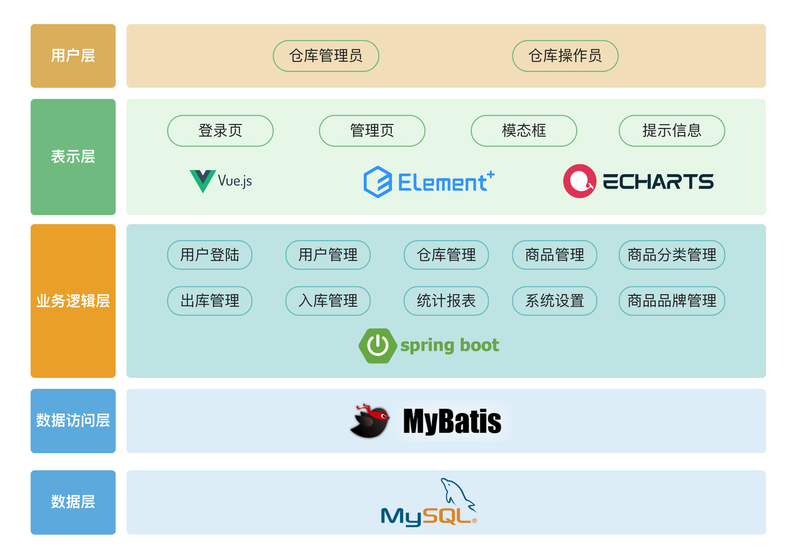

# 仓易通
## 在线访问
http://47.103.73.119/

## 项目描述
该系统用于满足中小型仓储公司日益增长的仓库管理需求，提供了强大且灵活的解决方案，包括用户、角色、权限、商品、分类、采购、入库、出库的管理。

系统基于 Spring Boot 和 MyBatis 构建，利用 MySQL 进行数据存储，Redis 用于缓存。通过 RESTful API 进行前后端分离，使用 JWT 进行身份验证，以及 RBAC 进行权限管理。使用 Vue 3 和 Element Plus 等前端技术以提升用户体验。

## 系统架构设计

## 项目亮点

- 验证码登陆和 JWT 验证：引入多种认证机制，提高系统的安全性。
- 整合 Spring Boot、MyBatis、MySQL、Redis、Vue3、Nginx 等技术，实现前后端的稳定运行。
- RESTful API 设计: 使前后端分离更加清晰，更易于维护和拓展。
- 整合 Redis 中间件作为缓存，提高了系统效率。
